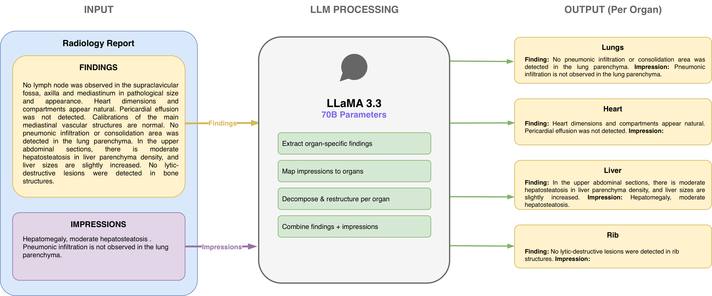
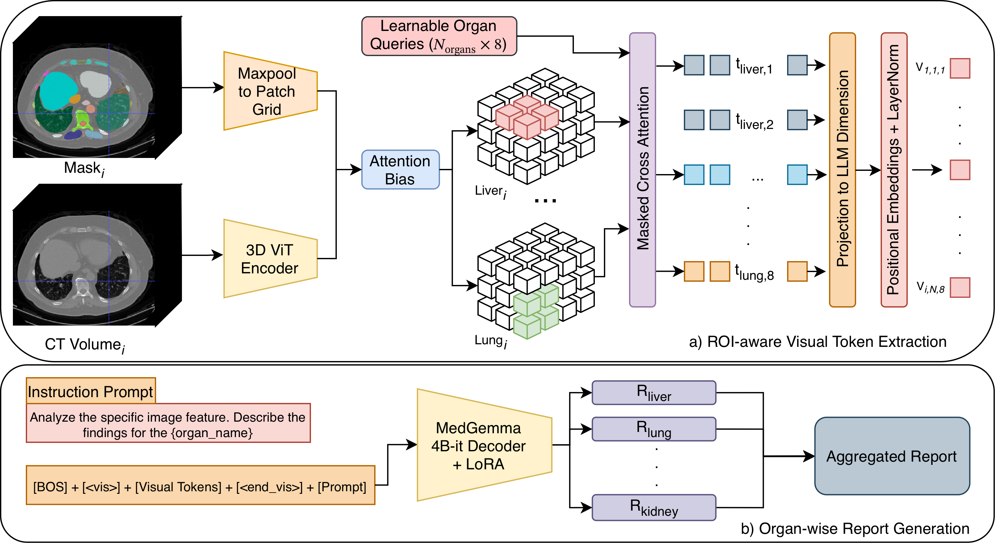
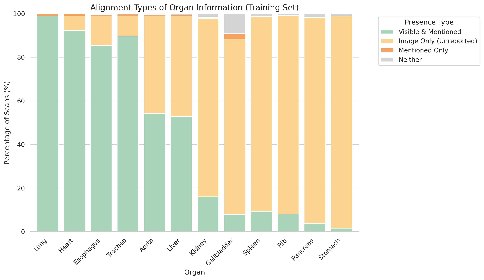
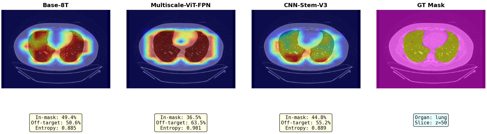
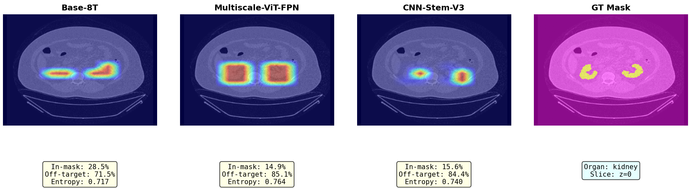

# Medical VLM for 3D CT Radiology Report Generation

Portfolio showcase for my thesis work on organ-aware radiology report generation from 3D chest CT using vision-language foundation models.

This repository summarizes the research workspace in [`gktpmuhammed/fvlm`](https://github.com/gktpmuhammed/fvlm), where I built and evaluated MedGemma-based VLM variants, organ-aware visual conditioning strategies, LoRA fine-tuning pipelines, and attention visualizations for 3D CT report generation.

The cleanest handover branch for the implementation is [`handover/clean-migration`](https://github.com/gktpmuhammed/fvlm/tree/handover/clean-migration). It keeps the code, setup scripts, environment notes, and smoke-test documentation without the heavy local generated artifacts.

## Why This Project

Radiology report generation from CT is difficult because the model needs to connect volumetric visual evidence with organ-specific clinical language. A useful system should do more than produce fluent text: it should preserve anatomical grounding, mention the right organs, and support model inspection when predictions fail.

This work explores how to condition language decoders on 3D CT visual representations and how to evaluate generated reports with both general language metrics and clinical/report-specific metrics.

## What I Built

- A reproducible organ-aware 3D report generation framework.
- LLM-based report decomposition into organ-level supervision.
- MedGemma-based 3D CT report generation pipelines.
- Visual-token conditioning for connecting CT image encoders to a medical language model.
- LoRA fine-tuning variants for efficient model adaptation.
- Positional embedding and visual-token ablation experiments.
- Organ-mask-guided conditioning and attention visualization scripts.
- Curriculum learning and hard-example mining experiments.
- Protocol-matched decoder comparisons across MedGemma, BERT-base, GPT-2, and BioBART.
- Clinical/report metric evaluation with GREEN, RadGraph, RadCliQ, CheXbert, BERTScore, and lexical metrics.

In the thesis pipeline, reference reports are decomposed into organ-keyed JSON targets using an instruction-following LLM pipeline based on Llama-3.3-70B-Instruct served through vLLM with AWQ quantization.

## Research Workspace

The implementation lives in the public fork:

```text
gktpmuhammed/fvlm/tree/handover/clean-migration
```

Main folders:

| Path | Purpose |
| --- | --- |
| `rep_medgemma/` | MedGemma-based report-generation experiments |
| `rep_medgemma/perceiver_resampler/` | Smoke-tested MedGemma path in the clean migration branch |
| `rep_medgemma/medgemma_lora_vis_token_pos_embed/` | LoRA + visual-token + positional embedding variant |
| `rep_medgemma/medical_vlm_8_tokens_full/` | 8 visual tokens per organ variant |
| `rep_medgemma/multiscale_vit_fpn/` | Multi-scale ViT/FPN experiment branch |
| `rep_medgemma/visualize_attention.py` | Attention visualization helper |
| `rep_vision_organ_attention/` | Organ-aware vision-language experiments |
| `rep_vision_bert/` | BERT-decoder comparison branch |
| `handover/` | Setup, data-link, environment, and smoke-test documentation |
| `scripts/setup/` | Environment rebuild and data symlink helpers |

## Architecture

Organ decomposition and generation pipeline:



Representative MedGemma instantiation of the shared organ-attention frontend:



```text
3D CT volume
  -> visual encoder
  -> organ masks and organ queries
  -> compact organ-conditioned visual tokens
  -> decoder-specific visual bridge
  -> organ-level report generation
  -> assembled radiology report
  -> clinical and language-based evaluation
```

The experiments compare different ways of passing visual evidence into language decoders, including token-count variants, mask downsampling, Perceiver-style resampling, multiscale visual fusion, alignment losses, and decoder-family changes.

## Final Results

### Core MedGemma Ablations

Core MedGemma ablations on the CT-RATE validation set. Values are reported as percentages, following the thesis tables. For RadCliQ, lower is better.

| Model | GREEN | BLEU-4 | METEOR | ROUGE-L | CIDEr | BERTScore | RadGraph | CheXbert | RadCliQ | SRR-BERT |
| --- | ---: | ---: | ---: | ---: | ---: | ---: | ---: | ---: | ---: | ---: |
| Base-1T | 31.6 | 8.3 | 31.8 | 33.5 | 2.5 | 56.4 | 23.9 | 18.4 | 100.2 | 28.9 |
| Base-8T | 32.8 | 8.8 | 32.5 | 34.4 | 4.1 | 56.9 | 24.6 | 22.7 | 104.1 | 32.7 |
| MaxPool-8T | 32.0 | 8.6 | 32.2 | 33.8 | 3.5 | 56.6 | 24.1 | 21.3 | 102.0 | 31.6 |
| Multiscale-8T | 32.7 | 8.6 | 32.2 | 33.7 | 4.3 | 56.6 | 24.2 | 24.1 | 102.2 | 32.6 |
| Perceiver-8T | 31.6 | 8.2 | 31.7 | 33.3 | 3.6 | 56.4 | 23.6 | 22.1 | 100.8 | 30.8 |
| CNNAlign-8T | 31.3 | 8.3 | 31.8 | 33.5 | 3.0 | 56.4 | 24.2 | 20.6 | 100.7 | 30.1 |
| Curriculum-8T | 19.4 | 3.2 | 25.0 | 25.0 | 1.8 | 50.7 | 13.3 | 26.9 | 77.3 | 32.2 |

Main takeaway: under matched MedGemma conditions, Base-8T improves over Base-1T on GREEN, RadGraph, and most lexical-semantic metrics. This supports the thesis conclusion that token budget and interface calibration matter more than added architectural complexity in this setup.

### Decoder-Family Comparison

Decoder comparison on CT-RATE under a shared organ-attention frontend. Values are reported as percentages; lower is better for RadCliQ.

| Decoder | GREEN | BLEU-4 | METEOR | ROUGE-L | CIDEr | BERTScore | RadGraph | CheXbert | RadCliQ | SRR-BERT |
| --- | ---: | ---: | ---: | ---: | ---: | ---: | ---: | ---: | ---: | ---: |
| MedGemma (Base-8T) | 32.8 | 8.8 | 32.5 | 34.4 | 4.1 | 56.9 | 24.6 | 22.7 | 104.1 | 32.7 |
| BERT-base (fVLM-aligned) | 38.2 | 11.9 | 37.1 | 40.3 | 6.2 | 62.0 | 25.2 | 27.5 | 109.2 | 35.3 |
| GPT-2 | 29.1 | 15.9 | 37.1 | 36.4 | 8.0 | 59.9 | 22.4 | 38.2 | 103.8 | 38.5 |
| BioBART | 28.8 | 10.0 | 32.2 | 36.5 | 4.1 | 59.0 | 21.9 | 28.0 | 96.8 | 33.5 |

The cross-decoder result is intentionally not a single-winner story. BERT-base is strongest on GREEN, RadGraph, ROUGE-L, and BERTScore; GPT-2 leads overlap-style metrics such as BLEU-4 and CIDEr; BioBART is strongest on RadCliQ; MedGemma shows much lower template reuse and higher output diversity.

### Decoder Diversity

Normalized full-report diversity diagnostics:

| Decoder | Unique report ratio | Top-1 template coverage | Top-5 template coverage | Top-50 template coverage | Effective-template ratio |
| --- | ---: | ---: | ---: | ---: | ---: |
| MedGemma (Base-8T) | 100.0 | 0.1 | 0.3 | 3.2 | 100.0 |
| BERT-base (fVLM-aligned) | 41.3 | 4.7 | 19.0 | 48.2 | 17.8 |
| GPT-2 | 60.7 | 4.0 | 13.2 | 32.5 | 35.4 |
| BioBART | 78.7 | 1.2 | 4.3 | 17.4 | 65.8 |

This is the strongest reason not to treat aggregate metrics alone as the final product decision: BERT-base ranks well on global metrics, while MedGemma produces substantially less templated output.

## Reproducibility Notes

The handover branch documents three environments:

- `fvlm_training_clean`: model training and evaluation.
- `radevalmetrics`: report metric evaluation.
- `decompose`: vLLM-based report decomposition.

The smoke-tested MedGemma path is:

```text
rep_medgemma/perceiver_resampler
```

It includes a training entry point, evaluation entry point, and `medical_vlm.py` model definition with trainable ViT features, organ masks, a Perceiver-style resampler, frozen MedGemma, and LoRA adapters.

## Visualizations

Organ visibility and report-presence alignment in the CT-RATE training split:



Head-averaged cross-attention overlays from the thesis:





For the representative `valid_730_a` case, Base-8T shows stronger in-mask concentration than heavier variants in both organs: lung 49.4% vs 36.5% and 44.8%; kidney 28.5% vs 14.9% and 15.6%. The thesis treats these maps as qualitative support, not standalone proof.

## What to Notice

This project is meant to show research engineering depth:

- adapting foundation VLM components to 3D medical imaging,
- building repeatable training and evaluation scripts,
- comparing architecture variants with clinical/report metrics,
- adding inspection tools instead of treating the model as a black box,
- connecting report text, organ-level reasoning, and volumetric image features.

## Related Work

This thesis workspace builds on the public FVLM codebase:

- Original repository/paper: [Fine-grained Vision-language Pre-training for Enhanced CT Image Understanding](https://github.com/alibaba-damo-academy/fvlm)
- My research workspace: [gktpmuhammed/fvlm](https://github.com/gktpmuhammed/fvlm)
- Thesis artifacts: figures and tables copied from the final LaTeX thesis source.

## Status

This is a showcase repository. The full experimental code currently remains in `gktpmuhammed/fvlm`. The next step is to copy the cleanest training, evaluation, and visualization scripts into this repository with minimal setup instructions.
